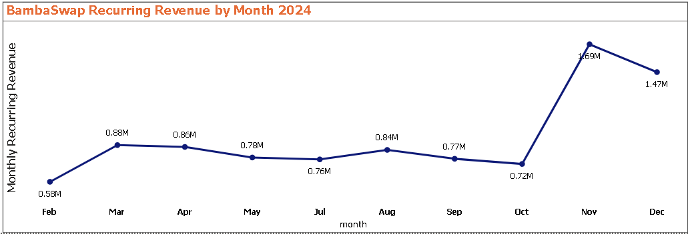
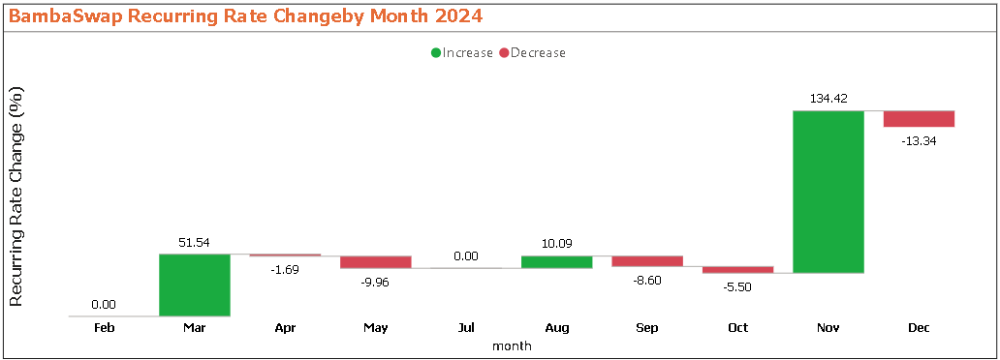
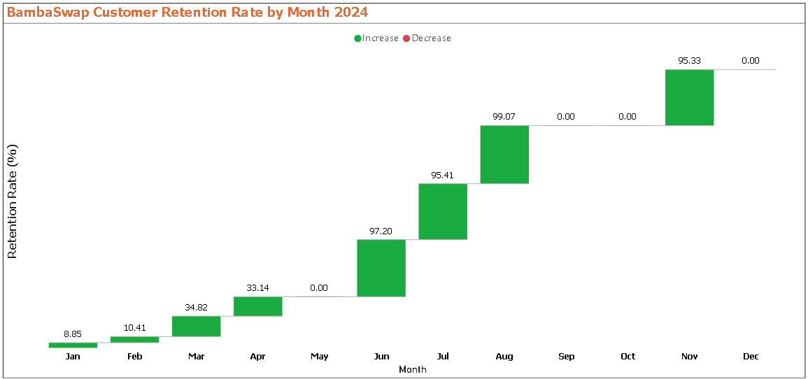
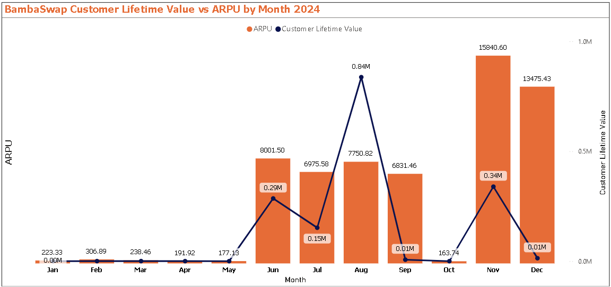

# BAMBASWAP ANNUAL KPI REPORT


### Period: January to December 2024

## **Introduction**

The Bambaswap 2024 KPI Report provides a comprehensive analysis of the company’s key performance indicators (KPIs), focusing on customer acquisition, retention, churn, revenue trends, and overall business sustainability.

This report aims to:

✅ Identify patterns in customer growth and engagement.

✅ Analyze revenue stability, customer lifetime value (CLV), and churn impact.

✅ Highlight key successes and challenges in customer retention.

✅ Provide actionable recommendations to optimize long-term business performance.

The findings reveal critical shifts in customer behavior, including strong revenue months followed by retention struggles, high-value customer segments, and periods of complete customer loss. By understanding these trends, Bambaswap can implement targeted strategies to improve retention, enhance revenue stability, and drive sustainable growth in 2025 and beyond.

**Key Takeaway:**
This report serves as a roadmap for Bambaswap to strengthen its business model by improving customer loyalty, reducing churn, and capitalizing on successful acquisition strategies.

## **Tools Used**

For my deep dive into the SwapFintech data analysis and KPI's, I harnessed the power of several key tools:

**SQL:** The backbone of my analysis, allowing me to query the database and unearth critical insights.

**PostgreSQL:** The chosen database management system, ideal for handling the SwapFintech data.

**Visual Studio Code:** My go-to for database management and executing SQL queries.

**Power BI:** Essential for visuals utilized during the analysis.

**Git & GitHub:** Essential for version control and sharing my SQL scripts and analysis, ensuring collaborations and project tracking.

## **The Analysis**

Each query for this project aimed at investigating specific aspect of the SwapFintech KPI's. KPIs identified for the Swap Fintech to track progress and drive business growth include:-

- **Customer Acquisition Rate (C.A.R)**
- **Cusomer Conversion Rate (C.C.R)**
- **Monthly Recurring Revenue (M.R.R)**
- **Monthly Retention Rate (R.R)**
- **Churn Rate (C.R)**
- **Customer Lifetime Value (C.L.V)**

### **1. Customer Acquisition Rate (C.A.R)**

**Customer Acquisition Rate (CAR)** measures how many new Bambaswap customers gained in the period 2024 relative to its existing customers. It helps track Bambaswap growth trends and marketing effectiveness.

To calculate the **CAR** we utilized the formula:-

$$ 
\mathit{CAR} = \frac{\mathit{New\ Customers\ in\ a\ Month}}{\mathit{Total\ Customers\ up\ to\ Current\ Month\ }} \times 100
$$

Where;-

•	**New Customers** - Customers appearing for the first time in a given month.

•	**Total Customers Up to Previous Month** - Customers who existed before that month.

•	Multiplying by 100 converts it into a percentage.

sql query used :-

``` sql
WITH customer_transactions AS (
    -- Count transactions per customer
    SELECT phone_number, COUNT(*) AS transaction_count
    FROM bambaswap_2024_data
    GROUP BY phone_number
    HAVING COUNT(*) > 1  -- Only customers with more than 1 transaction
),
monthly_customers AS (
    -- Get unique customers per month (who made >1 transactions)
    SELECT DISTINCT c.phone_number, b.month, b.month_number
    FROM bambaswap_2024_data b
    JOIN customer_transactions c ON b.phone_number = c.phone_number
),
existing_customers AS (
    -- Identify customers who appeared in previous months
    SELECT mc1.phone_number, mc1.month, mc1.month_number
    FROM monthly_customers mc1
    WHERE EXISTS (
        SELECT 1 FROM monthly_customers mc2 
        WHERE mc2.phone_number = mc1.phone_number 
        AND mc2.month_number < mc1.month_number
    )
),
new_customers AS (
    -- Identify first-time customers per month
    SELECT mc.phone_number, mc.month, mc.month_number
    FROM monthly_customers mc
    LEFT JOIN existing_customers ec 
    ON mc.phone_number = ec.phone_number
    WHERE ec.phone_number IS NULL  -- First-time customers
)
-- Calculate Customer Acquisition Rate (CAR) per month
SELECT 
    mc.month, 
    mc.month_number,
    -- Ensure correct percentage format and avoid NULL values
    COALESCE(
        ROUND(
            COUNT(DISTINCT nc.phone_number) * 100.0 / NULLIF(COUNT(DISTINCT ec.phone_number), 0), 2
        ), 0
    ) AS acquisition_rate_percentage
FROM monthly_customers mc
LEFT JOIN new_customers nc 
    ON mc.phone_number = nc.phone_number AND mc.month_number = nc.month_number
LEFT JOIN existing_customers ec 
    ON mc.phone_number = ec.phone_number AND mc.month_number < ec.month_number
GROUP BY mc.month, mc.month_number
ORDER BY mc.month_number;

```


*A powerBI generated waterfall graph showing the monthly changes in the average aquisition rates for BambaSwap in the year 2024.*

From the analysis and graph respesentation, the following conclusions can be drawn.

**1️. Strong Customer Growth in Early Months (Jan–May)** 

•	*January (90.69%)* and *February (270.85%)* had the **highest** CAR values, indicating a strong influx of new customers.

•	*March (56.64%)* and *April (67.54%)* saw a **decline** but still had a healthy acquisition rate.

•	*May (144.00%)* had another surge in new customers, suggesting a *successful campaign, product launch, or seasonal demand.*

 ✔️ Possible reasons: Strong marketing efforts, promotions, or business expansion.

**2️. Drastic Drop in New Customers from June Onward**

•	*June to December* saw almost no new customer acquisitions, with CAR **dropping** to **0%** in multiple months.

•	*July, September, October, November, and December* all recorded **0%** CAR, meaning **no new customers** were acquired.

•	*August* had a tiny acquisition rate (0.93%), but it was insignificant compared to earlier months.

**Possible reasons:**

✔️ Market saturation (business already acquired most potential customers).

✔️ Reduced marketing efforts.

✔️ Customer churn could be outpacing acquisition.

**3️. Business Shift: Retention Over Acquisition?**

•	The complete lack of new customers in the second half of the year suggests a shift in strategy.

•	If the business remained operational, it likely focused on retaining existing customers rather than acquiring new ones.

•	A high churn rate combined with no new acquisitions could signal business stagnation.

**Next Steps for Investigation:**

✔️ Were there fewer marketing campaigns in the second half of the year?

✔️ Did the business model change (e.g., shifting from acquisition to retention)?

✔️ Was there an external market factor affecting customer acquisition (e.g., economic downturn, competition)?


### **2. Customer Conversion Rate (C.C.R)**

**The Customer Conversion Rate (CCR)** measures how many newly acquired BambaSwap customers become engaged customers by making a significant number of transactions (in this case, more than 3 completed transactions).

How is **CCR** Different from **CAR**?

• **Customer Acquisition Rate (CAR)** measures how many new customers are added in a month.

• **Customer Conversion Rate (CCR)** measures how many of those who were customers in previous months come back in the current month.

The formula emoployed to calculate the CCR is :-

$$
\mathit{CCR} = \frac{\mathit{Converted\ Customers\ in\ a\ Month}}{\mathit{Total\ Acquired\ Customers\ in\ the\ Same\ Month\ }} \times 100
$$


•  **Converted Customers** → Customers who completed more than 3 transactions in a given month.

•  **Total Acquired Customers** → Customers who were newly acquired in that month.

What Insights Does This CCR Provide?

• *A High CCR (Near 100%)* → Great retention! Most Bambaswap customers who have used the service before are coming back.

• *A Low CCR (Close to 0%)* → Poor retention! Bambaswap Customers are not returning after their first experience.

• *Fluctuating CCR Trends* → Could indicate Bambaswap seasonal customer behavior or an issue with customer satisfaction.

sql query used :-
``` sql
WITH monthly_acquired_customers AS (
    -- Get new customers acquired each month
    SELECT DISTINCT phone_number, month, month_number
    FROM bambaswap_2024_data
),
monthly_converted_customers AS (
    -- Get customers who completed more than 3 transactions in a given month
    SELECT phone_number, month, month_number
    FROM bambaswap_2024_data
    WHERE state = 'complete'
    GROUP BY phone_number, month, month_number
    HAVING COUNT(*) > 3  -- Only count customers with more than 3 completed transactions
)
-- Calculate CCR per month
SELECT 
    ac.month, 
    ac.month_number,
    COALESCE(
        ROUND(
            COUNT(DISTINCT cc.phone_number) * 100.0 / NULLIF(COUNT(DISTINCT ac.phone_number), 0), 2
        ), 0
    ) AS conversion_rate_percentage
FROM monthly_acquired_customers ac
LEFT JOIN monthly_converted_customers cc 
    ON ac.phone_number = cc.phone_number AND ac.month_number = cc.month_number
GROUP BY ac.month, ac.month_number
ORDER BY ac.month_number;
```


*A powerBI generated waterfall graph showing the monthly BambaSwap average conversion rates for the year 2024*

From the above customer conversion anaysis, the following conclusions were made :-

**1️. Strong and Stable Conversion Performance in Mid-to-Late Year (Jun–Dec)**

•	From *June to December*, the CCR consistently stayed above **59%**, peaking at **62.62%** in *June and November*.

•	This suggests a *highly efficient conversion process*, meaning that once leads were generated, a majority converted into customers.

**Possible reasons:**

✔️ A more refined sales funnel or improved targeting strategies.

✔️ Returning customers or strong brand loyalty.

✔️ Seasonal factors or promotions driving high conversions.

**2️. Lower Conversion Rates in Early Months (Jan–May)**

•	*January to May* had significantly lower CCR values **(between 13% and 22%)**, meaning that more leads were generated but fewer converted.

•	*February* had the highest early-year CCR **(22.26%)**, possibly due to strong post-January marketing efforts.

**Possible reasons:**

✔️ Higher competition or customer hesitation early in the year.

✔️ New customer acquisition strategies that needed optimization.

✔️ The business may have been focused more on acquiring customers than converting them.

**3️. Sharp Drop in October (9.72%)** 

•	*October's* CCR plummeted to just **9.72%**, the lowest in the dataset.

•	This suggests a major breakdown in conversion efficiency, meaning that even if leads were generated, very few became customers.

**Possible reasons:**

✔️ Change in marketing strategy or messaging failure.

✔️ External factors (e.g., economic downturn, seasonal decline).

✔️ Operational or service-related issues affecting customer trust.

### **3. Monthly Recurring Revenue (M.R.R)**

**Monthly Recurring Revenue (MRR)** is a key financial metric that measures the predictable and recurring revenue BambaSwap earns each month from returning customers.

• It excludes one-time payments and focuses only on customers who continue to pay over time.

• For our dataset, **MRR** tracks revenue from customers who have transacted before, (bought airtime) in any previous period and are paying again.

How **MRR** is Different from **Total Revenue**?

• **Total Revenue** - tracks all payments made in a given month, including first-time customers.

• **MRR** - Only revenue from returning customers (customers who have paid before).

*Why This Matters:*

**MRR** is crucial for understanding customer retention and revenue stability. If **MRR** is growing, it means the BambaSwap business is retaining and monetizing existing customers well.

The formula that was employed to calculate the *MMR*:-

$$

\mathit {MMR} = {Sum\ of\ { Total\ Number\ of\ BambaSwap\ Return\ Customers\ in\ Month\ }} \times {\mathit {Average\ Revenue\ Per\ User}}{(A.R.P.U)}

$$

then;

$$
\mathit {MMR} = {Sum\ of\ { Revenue\ from\ Recurring\ Customers\ in\ Month\ }}
$$

Where:

• *Recurring Customers*: Customers who have paid in any previous month and return in current month.

• *Revenue*:The sum of Bambaswap revenue from all returning customers in current month.

*What Insights Can We Get From This MRR Calculation?*

• If **MRR** is growing → More customers are returning and paying again → Good retention & revenue stability.

• If **MRR** is declining → Fewer customers are returning → Possible churn issue.

• If **MRR** fluctuates → Indicates seasonality or inconsistent customer retention trends.

• If **MRR** is *0* in a month with transactions → That month only had new customers (not returning ones).

The sql query used :-

``` sql
WITH monthly_revenue AS (
    -- Get total revenue per customer per month
    SELECT phone_number, month, month_number, SUM(bs_revenue) AS total_revenue
    FROM bambaswap_2024_data
    GROUP BY phone_number, month, month_number
),
previous_customers AS (
    -- Identify customers who have paid in any month before or after the current month
    SELECT DISTINCT mr1.phone_number, mr1.month, mr1.month_number
    FROM monthly_revenue mr1
    LEFT JOIN monthly_revenue mr2
    ON mr1.phone_number = mr2.phone_number 
    AND mr2.month_number < mr1.month_number  -- Customer has past payments
    WHERE mr2.phone_number IS NOT NULL
),
recurring_customers AS (
    -- Customers who made payments in previous months OR will make payments later
    SELECT DISTINCT phone_number, month, month_number
    FROM previous_customers
    UNION
    SELECT DISTINCT mr1.phone_number, mr1.month, mr1.month_number
    FROM monthly_revenue mr1
    JOIN monthly_revenue mr2
    ON mr1.phone_number = mr2.phone_number 
    AND mr1.month_number > mr2.month_number  -- Customer pays again later
),
mrr_per_month AS (
    -- Calculate MRR per month
    SELECT 
        mr.month, 
        mr.month_number,
        COALESCE(SUM(mr.total_revenue), 0) AS monthly_recurring_revenue
    FROM monthly_revenue mr
    INNER JOIN recurring_customers rc 
    ON mr.phone_number = rc.phone_number AND mr.month = rc.month
    GROUP BY mr.month, mr.month_number
)
-- Final MRR with % Change Calculation
SELECT 
    m1.month,
    m1.month_number,
    m1.monthly_recurring_revenue,
    -- Calculate % Change from previous month
    COALESCE(
        ROUND(
            ((m1.monthly_recurring_revenue - m2.monthly_recurring_revenue) * 100.0) 
            / NULLIF(m2.monthly_recurring_revenue, 0), 2
        ), 0
    ) AS percent_change
FROM mrr_per_month m1
LEFT JOIN mrr_per_month m2 
ON m1.month_number = m2.month_number + 1  -- Get previous month's MRR
ORDER BY m1.month_number;
```






*A powerBI generated graph showing the monthly changes in monthly ARPU and Monthly Recurring Rate cchange for BambaSwap*


Here are three main summary insights from the Monthly Recurring Revenue (MRR) data for Bambaswap from the year 2024:-

1️. **Strong Growth in Early & Late Year, But Inconsistent Revenue Trends**

•	*March* **(51.54%)** and *November* **(134.42%)** saw the biggest revenue spikes.

o *March's* jump suggests a successful expansion, campaign, or new customer sign-ups.

o *November's* **134.42%** surge is massive—possibly a seasonal effect, major sales event, or high customer acquisition.

• Several months *(April, May, September, October, December)* had revenue drops, signaling inconsistent retention or business slowdowns.

**Possible reasons:**

✔️ March & November had strong acquisition strategies or promotions.

✔️ Some months saw higher churn or lost contracts.

✔️ Business might be seasonally affected, depending on the industry.

**2️. Periods of Revenue Decline Indicate Retention Challenges**

•	*April* **(-1.69%)**, *May* **(-9.96%)**, *September* **(-8.60%)**, *October* **(-5.50%)**, and *December* **(-13.34%)** all had declining MRR.

•	*December’s* **-13.34%** drop after a strong November suggests high churn, meaning many customers did not renew.

**Possible reasons:**

✔️ Customers are leaving faster than being acquired.

✔️ Seasonal slowdowns in some months.

✔️ Pricing changes or customer dissatisfaction.

**3️. Missing Data for June Shows a Potential Gap in Revenue Tracking or Business Pause**

•	There is no data for *June, and July’s* revenue is lower than *May*, suggesting either:

o	A reporting gap (data missing for *June*).

o	A temporary pause in business activity or revenue reporting.

 Action Required:

✔️ Confirm if June data is missing or if the business had zero revenue that month.


### **4. Monthly Retention Rate (M.R.R)**

**The Retention Rate (R.R)** is a key customer success metric that measures the percentage of BambaSwap existing customers who continue paying month after month.

• It tells us how well the bambaswap retains customers over time.

• A high retention rate indicates strong customer loyalty, while a low rate suggests customer churn (customers are leaving).

To calculate the **Retention Rate (R.R)**, we used the following formula:


$$
\mathit {Retention Rate} = (\frac {{\mathit Returning\ Customers\ Month\ m}}{\mathit {Total\ Customers\ in\ Month\ m-1}}) \mathit {\times 100}
$$


Where:

• *Returning Customers in Month m* → Bambaswap Customers who paid in m-1 and continue paying in m.

• *Total Customers in Month m-1* → All unique customers who paid in the previous month.

*What Insights Can We Get From This Query?*

• If Retention Rate is high → Customers continue using the service, indicating strong loyalty.

• If Retention Rate is dropping → Churn rate is increasing, meaning customers are leaving.

• If Retention Rate is 0% for a month → No customers from m-1 returned in m.

• Seasonal Retention Trends → If retention fluctuates, it could be due to seasonal demand or product changes.

Query used was to calculate the **MRR** is:-
``` sql
WITH monthly_customers AS (
    -- Get distinct paying customers per month
    SELECT DISTINCT phone_number, month, month_number
    FROM bambaswap_2024_data
),
previous_month_customers AS (
    -- Count total customers in the previous month
    SELECT mc1.month AS previous_month, 
           mc1.month_number AS previous_month_number, 
           COUNT(DISTINCT mc1.phone_number) AS total_previous_customers
    FROM monthly_customers mc1
    GROUP BY mc1.month, mc1.month_number
),
returning_customers AS (
    -- Count returning customers (who paid in `m-1` and are still paying in `m`)
    SELECT mc2.month AS current_month, 
           mc2.month_number AS current_month_number, 
           COUNT(DISTINCT mc2.phone_number) AS returning_customers
    FROM monthly_customers mc2
    LEFT JOIN monthly_customers mc1  -- Use LEFT JOIN to keep all records
    ON mc2.phone_number = mc1.phone_number
    AND mc2.month_number = mc1.month_number + 1  -- Ensures they paid in both `m-1` and `m`
    GROUP BY mc2.month, mc2.month_number
)
-- Calculate Monthly Retention Rate as a Percentage
SELECT 
    pm.previous_month,
    pm.previous_month_number,
    COALESCE(rc.current_month, 'No Returning Customers') AS current_month,
    COALESCE(rc.current_month_number, pm.previous_month_number + 1) AS current_month_number,
    -- Calculate Retention Rate as a Percentage, avoiding division by zero
    COALESCE(ROUND((rc.returning_customers * 100.0 / NULLIF(pm.total_previous_customers, 0)), 2), 0) AS retention_rate_percentage
FROM previous_month_customers pm
LEFT JOIN returning_customers rc 
ON pm.previous_month_number + 1 = rc.current_month_number
ORDER BY pm.previous_month_number;
```


*A powerBI generated graph showing BambaSwap 2024 changes in Retention Rate*

Here are the main insights drawn from the analyzed BambaSwap Retention Rate.

**1️. Poor Retention in Early Months (Jan–May) Suggests High Churn**

•	*January* **(8.85%)** and *February* **(10.41%)** had very low retention, meaning almost 90% of customers churned each month.

•	*March* **(34.82%)** and *April* **(33.14%)** saw some improvement, but still, over 65% of customers left each month.

•	*May* **(0%)** indicates a complete customer reset, meaning no customers continued into *June.*

**Possible reasons:**

✔️ **High customer churn** → Customers may not be satisfied with the service.

✔️ **Short-term engagement** → Business might rely on one-time purchases rather than long-term users.

✔️ **Marketing gaps** → Business may be acquiring customers but failing to retain them.

This is a critical problem → BambaSwap is not holding onto early customers, leading to repeated revenue loss.

**2️. Strong Retention in Mid-Year (Jun–Sep) Suggests Business Recovery.**

•	*June* **(97.2%)**, *July* **(95.41%)**, *August* **(99.07%)** had excellent retention.

•	This suggests a shift in business strategy, where customers were more engaged, loyal, or locked into a longer-term commitment.

**Possible reasons:**

✔️ Improved service quality, pricing, or customer experience.

✔️ Long-term contracts, subscriptions, or retention incentives.

✔️ Returning customers who left earlier in the year but rejoined in mid-year.

 This period is crucial! → BambaSwap finally retained customers well, and strategies used here should be analyzed for long-term success.

**3️. Severe Drop-offs in September, October & December Show Long-Term Retention Issues.**

•	*September* **(0%)** and *October* **(0%)** indicate a complete loss of customers → Whatever caused high retention earlier suddenly failed.

•	*December* **(0%)** suggests no customers carried into the next year, meaning the business had no loyal base left by year-end.

**Possible reasons:**

✔️ Short-term engagement model (customers only stay for a few months).

✔️ No renewal strategy.

✔️ Seasonality effects → campaign that sells well in mid-year but loses demand later.

Major Warning: The BambaSwap failed to sustain its mid-year retention success, leading to a complete wipeout of customers in key months.

### **5. Monthly Churn Rate (R.R)**

**Churn Rate** measures the percentage of Bambaswap customers who stop paying from one month to the next. It is the opposite of Retention Rate.

• If Retention Rate is high, Churn Rate is low → Business is retaining customers well.

• If Churn Rate is high, it means many customers are leaving the service.

To calculate the **Churn Rate**, use the following formula:

### **5. Monthly Churn Rate (R.R)**

**Churn Rate** measures the percentage of Bambaswap customers who stop paying from one month to the next. It is the opposite of Retention Rate.

• If Retention Rate is high, Churn Rate is low → Business is retaining customers well.

• If Churn Rate is high, it means many customers are leaving the service.

To calculate the **Churn Rate**, use the following formula:

$$
\mathit{Churn\ Rate}_{(m)} = \frac{\mathit{Customers\ who\ Left\ in\ Month\ m}}{\mathit{Total\ Customers\ in\ Month\ m-1}} \times 100
$$

Where:

• *Churned Customers in Month m* → Customers who paid in m-1 but did not pay in m.

• *Total Customers in Month m-1* → All unique customers who paid in m-1.

*What Insights Can We Get?*

• If Churn Rate is high → Many customers are leaving → Possible retention issues.

• If Churn Rate is low → Customers are staying & continuing to pay.

• If Churn Rate fluctuates → Could indicate seasonal trends or business model changes.

• If Churn Rate is 0% for a month → No customers from m-1 left (great retention).

Here is the sql query used for the churn rate;-

``` sql
WITH monthly_customers AS (
    -- Get distinct paying customers per month
    SELECT DISTINCT phone_number, month, month_number
    FROM bambaswap_2024_data
),
previous_month_customers AS (
    -- Count total customers in the previous month
    SELECT mc1.month AS previous_month, 
           mc1.month_number AS previous_month_number, 
           COUNT(DISTINCT mc1.phone_number) AS total_previous_customers
    FROM monthly_customers mc1
    GROUP BY mc1.month, mc1.month_number
),
returning_customers AS (
    -- Count returning customers (who paid in `m-1` and are still paying in `m`)
    SELECT mc2.month AS current_month, 
           mc2.month_number AS current_month_number, 
           COUNT(DISTINCT mc2.phone_number) AS returning_customers
    FROM monthly_customers mc2
    JOIN monthly_customers mc1
    ON mc2.phone_number = mc1.phone_number
    AND mc2.month_number = mc1.month_number + 1  -- Ensures they paid in both `m-1` and `m`
    GROUP BY mc2.month, mc2.month_number
)
-- Calculate Monthly Churn Rate
SELECT 
    pm.previous_month,
    pm.previous_month_number,
    COALESCE(rc.current_month, 'No Returning Customers') AS current_month,
    COALESCE(rc.current_month_number, pm.previous_month_number + 1) AS current_month_number,
    -- Churn Rate = (Total Customers in `m-1` - Returning Customers in `m`) / Total Customers in `m-1`
    COALESCE(((pm.total_previous_customers - COALESCE(rc.returning_customers, 0)) * 100.0 / 
              GREATEST(pm.total_previous_customers, 1)), 0) AS churn_rate
FROM previous_month_customers pm
LEFT JOIN returning_customers rc 
ON pm.previous_month_number + 1 = rc.current_month_number
ORDER BY pm.previous_month_number;
```


*A powerBI generated graph showing the monthly changes in Monthly Churn Rate*

BambaSwap churn Rate insight from the above analysis ;-

**1️. Extremely High Churn in Early Months (Jan–May)**

•	*January* **(91.15%)** and *February* **(89.59%)** had massive churn, meaning almost 90% of customers left every month.

•	*March* **(65.18%)** and *April* **(66.86%)** showed some improvement, but churn was still dangerously high.

•	*May* hit **100%** churn, meaning all customers left and zero carried over to June.

**Possible reasons:**

✔️ **Short-term customer engagement** – Customers might be using the BambaSwap service once and leaving.

✔️ **Lack of retention strategies** – No incentives for customers to stay longer.

✔️ **Poor onboarding or service experience** – Customers may not see long-term value.

This is a serious issue → The business is losing customers faster than acquiring them in the early months.

**2️. Strong Retention Mid-Year (Jun–Sep)**

•	*June* **(2.80%)**, *July* **(4.59%)**, and *August* **(0.93%)** had low churn, meaning almost all customers stayed.

•	This suggests a successful retention strategy or a long-term customer commitment.

**Possible reasons:**

✔️ Successful engagement strategies introduced in June.

✔️ BambaSwap longterm Customers reduced churn temporarily.

✔️ Better customer satisfaction or loyalty in mid-year.

This was a key recovery period – BambaSwap managed to retain most of its customers after the initial high churn.

**3️. Churn Spikes Again in Late-Year (Sep–Dec)**

•	*September, October, and December* hit **100%** churn, meaning no customers stayed for the next month.

•	This completely wiped out the customer base, leading to zero retention beyond December.

**Possible reasons:**

✔️ BambaSwap lacks renewal strategy.

✔️ Customers only engaged for a short period (mid-year success was temporary).

✔️ Service ended, pricing changed, or market demand shifted.

**Major Red Flag:** This shows the business failed to sustain retention efforts beyond mid-year.

### **6. Customer Lifetime Value (CLV)**

**Customer Lifetime Value (CLV)** estimates the total revenue Bambaswap can expect from a single customer over their entire relationship with Bambaswap.

• Higher CLV means customers stay longer and spend more.

• Lower CLV suggests short customer relationships or low spending.

BambaSwap CLV is calculated on a monthly using the formula:-

$$
\mathit {CLV}_{m} = ARPU_m\ \times (\frac {\mathit{1}}{\mathit {Churn\ Rate_m}}) \times 100
$$

where:

• **ARPU (Average Revenue Per User):** This is calculated as the total revenue in month m divided by the total customers in month m.

• **Churn Rate:** The percentage of customers who did not return in the following month.

The below query was utilized to calculate the CLV

``` sql
WITH monthly_revenue AS (
    -- Get total revenue per month
    SELECT month, month_number, SUM(bs_revenue) AS total_revenue, COUNT(DISTINCT phone_number) AS total_customers
    FROM bambaswap_2024_data
    GROUP BY month, month_number
),
churn_data AS (
    -- Get churn rate per month (from previous churn rate query)
    WITH monthly_customers AS (
        -- Get distinct paying customers per month
        SELECT DISTINCT phone_number, month, month_number
        FROM bambaswap_2024_data
        
    ),
    previous_month_customers AS (
        -- Count total customers in the previous month
        SELECT mc1.month AS previous_month, 
               mc1.month_number AS previous_month_number, 
               COUNT(DISTINCT mc1.phone_number) AS total_previous_customers
        FROM monthly_customers mc1
        GROUP BY mc1.month, mc1.month_number
    ),
    returning_customers AS (
        -- Count returning customers (who paid in `m-1` and are still paying in `m`)
        SELECT mc2.month AS current_month, 
               mc2.month_number AS current_month_number, 
               COUNT(DISTINCT mc2.phone_number) AS returning_customers
        FROM monthly_customers mc2
        JOIN monthly_customers mc1
        ON mc2.phone_number = mc1.phone_number
        AND mc2.month_number = mc1.month_number + 1  -- Ensures they paid in both `m-1` and `m`
        GROUP BY mc2.month, mc2.month_number
    )
    -- Calculate Monthly Churn Rate
    SELECT 
        pm.previous_month,
        pm.previous_month_number,
        rc.current_month,
        rc.current_month_number,
        -- Churn Rate = (Total Customers in `m-1` - Returning Customers in `m`) / Total Customers in `m-1`
        COALESCE(((pm.total_previous_customers - COALESCE(rc.returning_customers, 0)) * 1.0 / 
                  GREATEST(pm.total_previous_customers, 1)), 0) AS churn_rate
    FROM previous_month_customers pm
    LEFT JOIN returning_customers rc 
    ON pm.previous_month_number + 1 = rc.current_month_number
)
-- Calculate CLV per month
SELECT 
    mr.month, 
    mr.month_number,
    (mr.total_revenue * 1.0 / NULLIF(mr.total_customers, 0)) AS ARPU,  -- Avoid division by zero
    cd.churn_rate,
    CASE 
        WHEN cd.churn_rate = 0 THEN NULL  -- Prevent division by zero
        ELSE (mr.total_revenue / NULLIF(mr.total_customers, 0)) * (1.0 / cd.churn_rate)
    END AS customer_lifetime_value
FROM monthly_revenue mr
LEFT JOIN churn_data cd 
ON mr.month_number = cd.previous_month_number
ORDER BY mr.month_number;
```



*A powerBI generated graph showing the monthly changes in ARPU and Customer Lifetime Value*

**1️. CLV and ARPU Fluctuate Wildly, Indicating an Inconsistent Revenue Model**

•	**ARPU (Average Revenue Per User)** and **CLV (Customer Lifetime Value)** are highly unstable, showing extreme peaks and drops.

•	*June* **(ARPU: $8001.49, CLV: $285,386.67)** and *November* **(ARPU: ksh.15,840.60, CLV: ksh.338,988.80)** saw massive revenue spikes, suggesting high-value customers during these months.

•	However, *May, September, October, and December* all dropped to extremely low values.

**Possible reasons:**

✔️ BambaSwap may have a mix of high-paying and low-paying customers, leading to erratic revenue.

✔️ Short-term contracts or seasonal purchases could explain revenue surges followed by collapses.

✔️ Shows BambaSwap might rely on a few big customers rather than a stable user base.

**2️. Extremely High Churn in Certain Months Suggests Retention Issues**

•	*May, September, October, and December* all had 100% churn, meaning every single customer left those months.

•	This completely wiped out **customer lifetime value (CLV)** in those months.

•	Months with low churn (*June*: **2.80%**, *August*: **0.93%**, *November*: **4.67%**) had much higher CLV, showing the direct impact of retention on customer profitability.

**Possible reasons:**

✔️ BambaSwap failed to retain customers beyond a short period.

✔️ Certain months may represent one time customers.

✔️ Customers aren’t seeing long-term value, leading to repeated churn spikes.

**Critical Warning:** The business is heavily reliant on short bursts of high-revenue customers, but failing to maintain them long-term.

**3️. CLV is Strong in Certain Months, Indicating a Selective Customer Base**

•	*August* **(ksh.837,088.99)** and *November* **(ksh.338,988.80)** had exceptionally high CLV, meaning customers acquired in those months generated long-term revenue.

•	These months also had low churn, proving that longer customer retention significantly boosts revenue.

**Possible reasons:**

✔️ Premium customers acquired in *August* & *November* may have had long-term value.

✔️ Strategic pricing or marketing efforts may have locked in high-value customers.

✔️ If this pattern is predictable, BambaSwap should focus on replicating the strategies that worked during these months.


# **Conclusion**

**1️. Inconsistent Revenue & Customer Lifetime Value (CLV) Pose Sustainability Risks**

**ARPU** and ****CLV** fluctuated drastically, with massive spikes in *June, August, and November* but complete collapses in *May, September, October, and December*.

High-value customers contributed significantly during peak months, but the business struggled to sustain a stable revenue base.

This suggests over-reliance on short-term, high-spending customers instead of a consistently growing user base.

**Action Needed:** Implement more stable pricing models, customer loyalty programs, or subscription-based services to smooth revenue inconsistencies.

**2️. Severe Retention & Churn Issues Threaten Long-Term Growth.**

**Churn** hit **100%** in multiple months *(May, September, October, December)*, completely erasing customer retention.
Even months with high **CLV** *(August, November)* saw churn rise again shortly after, meaning the business isn’t holding onto customers long enough.

The retention rate peaked mid-year *(June–September)*, suggesting short-term customer satisfaction but long-term disengagement.

**Action Needed:**

✔️ Improve customer engagement beyond the first few months through loyalty incentives and value-driven retention strategies.

✔️ Investigate why customers leave after peak revenue months to prevent future churn cycles.

**3️. Strong Performance in August & November Provides a Playbook for Growth**

*August* and *November* saw high **CLV**, **low churn**, and **strong retention**, proving that effective retention strategies were in place during these months.

The business should analyze what worked well in these periods—whether it was pricing adjustments, promotional offers, or improved customer experience.

**Action Needed:**

✔️ Replicate successful strategies from *August & November* year-round to improve customer retention.

✔️ Shift focus from short-term gains to long-term customer engagement through tailored marketing and customer support improvements.

**Final Takeaway: Urgent Need for Retention & Revenue Stabilization**

**1️⃣ Revenue & CLV are unpredictable** → A more consistent pricing model is needed.

**2️⃣ Churn spikes wipe out customer base** → Focus on customer retention & post-purchase engagement.

**3️⃣ August & November show a winning formula** → Learn from these months and scale successful strategies across the year.

**Next Steps:**
**Deep dive into customer churn patterns** → What’s driving customers away?

**Strengthen long-term engagement models** → How can Bambaswap keep customers beyond a few months?

Standardize successful retention methods from high-performing months.


